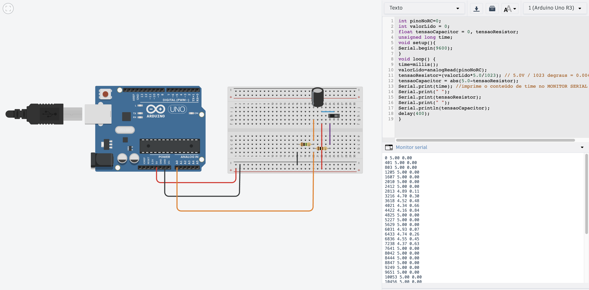
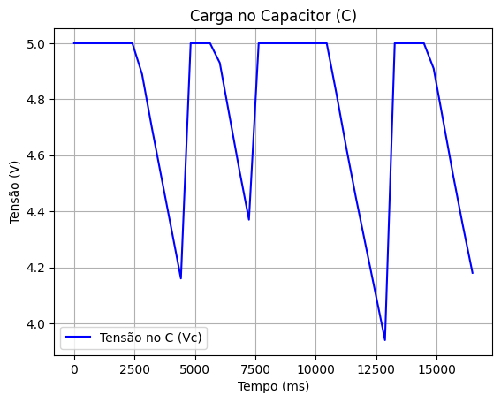
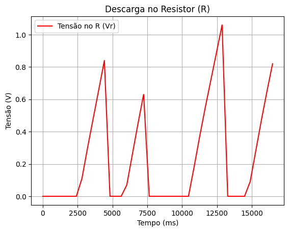
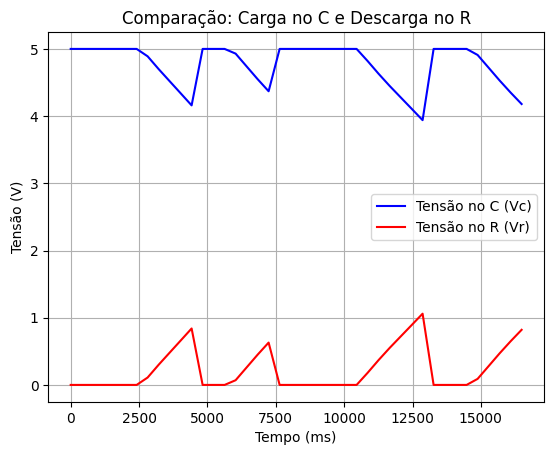

# Projeto: Análise de Circuito RC com Arduino e Python

Este projeto prático demonstra como um capacitor carrega e descarrega ao longo do tempo. Um Arduino é utilizado para ler a variação de tensão no capacitor (através da entrada analógica A0) e esses dados são, em seguida, processados com um script Python para gerar visualizações gráficas.

## 1. Componentes e Montagem

O circuito foi montado em uma protoboard (simulado no Tinkercad) e conectado a um Arduino Uno.

### Componentes Principais
* **Arduino Uno**
* **Capacitor:** $C = 10\mu F$
* **Resistor de Descarga:** $Re = 1M\Omega$
* **Resistor de Carga:** $Rd = 100\Omega$
* **Chave** (Botão)
* **Protoboard e Jumpers**

### Diagrama
A imagem `print_tinkercad.png` mostra a montagem do circuito. O pino **A0** do Arduino lê a tensão diretamente do capacitor.

## 2. Funcionamento

1.  **Coleta de Dados (Arduino):** O código no Arduino mede continuamente a tensão no capacitor ($V_C$) no pino A0. Ele também calcula a tensão no resistor ($V_R = 5V - V_C$) e envia ambos os valores, junto com o tempo (`millis()`), para o Monitor Serial.
2.  **Processamento (Python):** Os dados brutos do Monitor Serial (coletados durante a **descarga** do capacitor) são copiados e colados em um script Python.
3.  **Visualização:** O script gera os gráficos que analisam o comportamento do circuito.

## 3. Resultados Gráficos

Os dados coletados da descarga do capacitor geraram os seguintes gráficos:

### 1. Tensão no Capacitor (C)
O gráfico `caraga_capactiro.png` mostra a curva de descarga exponencial do capacitor. A tensão ($V_C$) começa alta (próxima de 5V) e diminui ao longo do tempo.

### 2. Tensão no Resistor (R)
O gráfico `descarga_resistor.png` mostra a tensão no resistor ($V_R$). Como $V_R$ é calculada como $5V - V_C$, sua curva é o inverso da descarga do capacitor, começando próxima de 0V e aumentando.

### 3. Comparação
O gráfico `comparacao.png` plota ambas as curvas no mesmo eixo, ilustrando visualmente a lei das malhas de Kirchhoff ($V_{Total} \approx V_C + V_R$), onde a soma das tensões se mantém constante.

